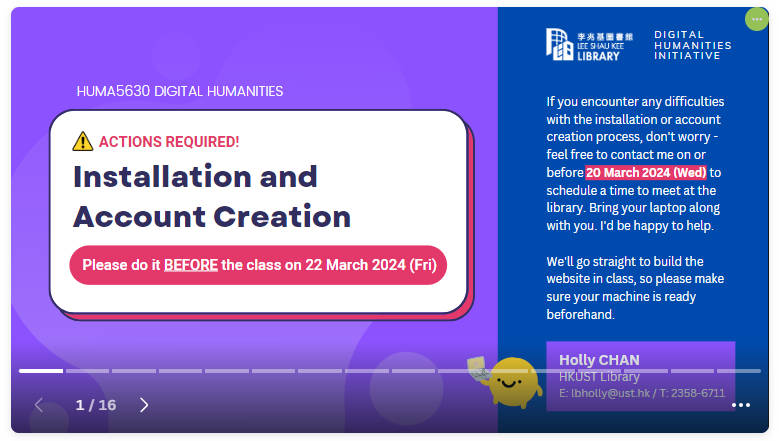
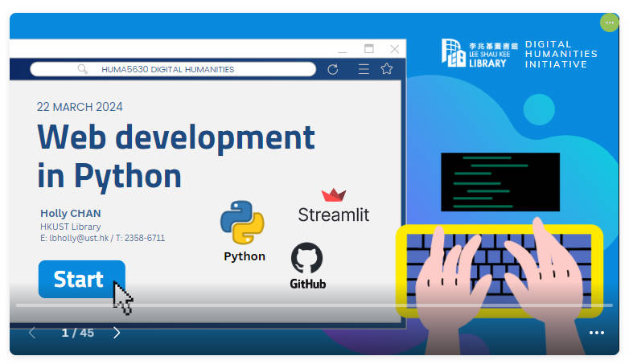

# Web Development using Python

This repository contains the source code of the demo session and the presentation slides for 2023/2024 Spring semester HUMA5630's Unit 8 class on 22 March 2024.

 

URL: https://hkust-dh-demo-20240322.streamlit.app/

## Guideline of Accounts creation and Installation before class

[Slides in PDF](https://github.com/hkust-dh/streamlit-demo-20240322/blob/main/DH%20March%2022_do-it-before-class.pdf) | [Slides in Canva](https://www.canva.com/design/DAF-icJhatY/5jIQvpZZWOZb8f4I-4csvA/view)

## Presentation slides in class

[Slides in PDF](https://github.com/hkust-dh/streamlit-demo-20240322/blob/main/DH%20March%2022_tutorial.pdf) | [Slides in Canva](https://www.canva.com/design/DAF9OL_Atz4/D9bUHJ-Xi7lzw2An-HFMVg/view)

## Related articles (optional readings)

-   [Learn Python From Zero For Absolute Beginner (3): Create Website](https://digitalhumanities.hkust.edu.hk/tutorials/learn-python-from-zero-for-absolute-beginner-3-create-website/)
-   [Markdown Cheat Sheet & Introduction: From Plain Text To Rich Content](https://digitalhumanities.hkust.edu.hk/tutorials/markdown-cheat-sheet-introduction-from-plain-text-to-rich-content/)

## Open access
Created by [Holly Chan (lbholly@ust.hk)](mailto:lbholly@ust.hk) from the HKUST Library for the course [HUMA5630 "Digital Humanities"](https://digitalhumanities.hkust.edu.hk/studentprojects/) under [Creative Commons CC BY License](https://creativecommons.org/licenses/by/4.0/)

